css: https://cdn.jsdelivr.net/npm/water.css@2/out/water.css

# DSW for depositar 使用手冊

> [Data Stewardship Wizard](https://ds-wizard.org/) (DSW) 是一套開源的資料管理方案 (Data Management Plan, DMP) 工具，由捷克布拉格捷克理工大學與 ELIXIR Czech Republic (ELIXIR CZ) 團隊共同發展。
>
> DSW 將傳統靜態的 DMP 文件轉化為互動式、可持續更新的資料管理規劃工具。研究人員可透過問答式介面，逐步思考資料蒐集、儲存、文件化、共享、授權、保存及 FAIR 原則等議題，並依研究過程持續更新內容。DSW 亦支援不同機構或研究領域建立自己的知識模型與 DMP 範本，使資料管理規劃能更貼近實際研究需求。
>
> 本使用手冊僅概要介紹 DSW for depositar 服務的基本功能操作。詳細說明請參考[官方文件](https://guide.ds-wizard.org/)。

- [註冊帳號與登入](#section)
- [專案管理功能](#section-1)
    - [建立專案](#section-2)
    - [填寫問卷](#section-3)
    - [產製資料管理方案 (DMP) 文件](#dmp-)
    - [專案協作](#section-4)

## 註冊帳號與登入

1. 您可於本服務首頁 (https://dsw.depositar.io/) 右上方點選 `Sign Up` 來建立一個帳號：

    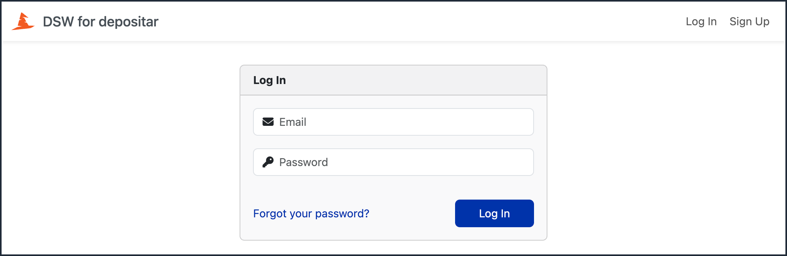

2. 您必須提供電子郵件 (Email)、名字 (First name)、姓氏 (Last name) 與密碼 (Password)，所屬機構 (Affiliation) 則為選填：

    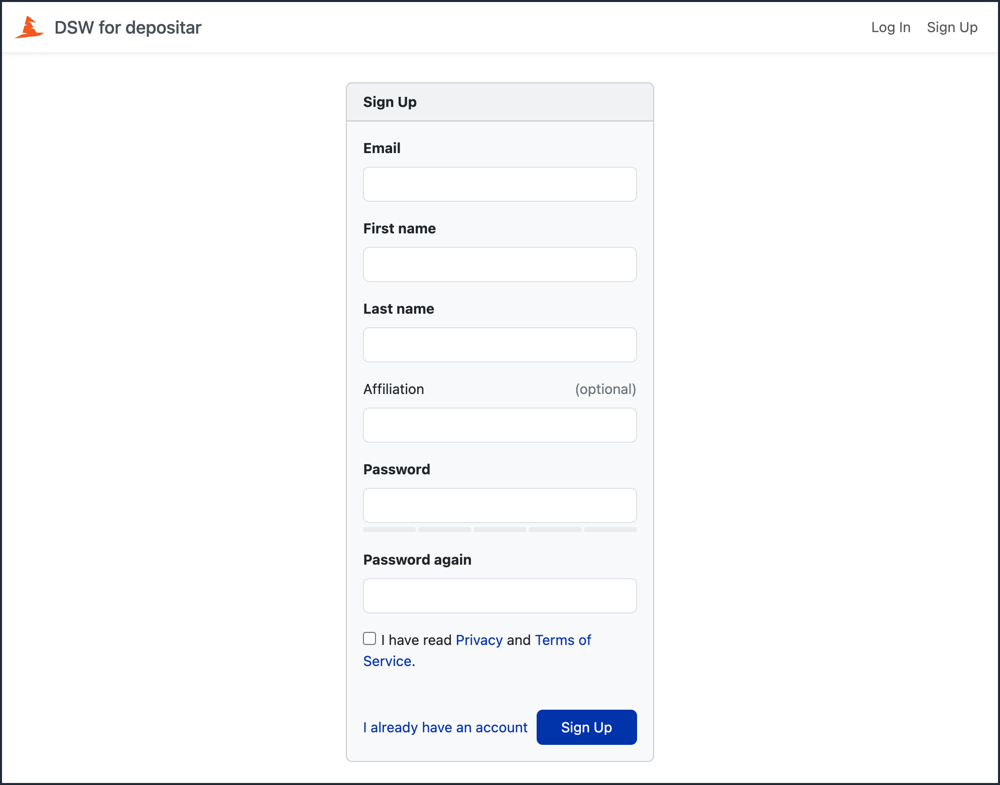

3. 閱讀隱私條款與服務條款，勾選核取方塊，並點選註冊後，系統將發送註冊確認信件至您的電子郵件信箱。請點選確認信件中的 `Activate your account` 連結以完成註冊：

    

4. 完成註冊後，您即可於首頁輸入電子郵件與密碼，以登入您的帳號。

5. 若您欲使用中文介面，可在登入後，將滑鼠移至頁面左下方的個人資料卡，點選 `Change language`，並在下一個畫面選擇 `Chinese (Traditional Han script)` 後點選 `Save`，便可將介面更改為中文：

    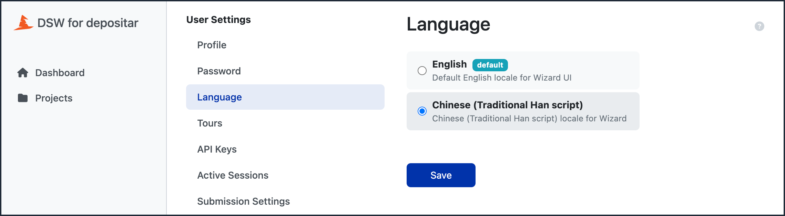

> **備註：**
>
> 新註冊之帳號，預設為「研究人員 (Researcher)」角色。關於使用者角色，請參考[官方文件](https://guide.ds-wizard.org/en/latest/application/administration/roles/index.html)說明。

## 專案管理功能

在產製資料管理方案 (Data Management Plan, DMP) 前，您必須為您的研究計畫建立一個專案，並填寫專案內的問卷。系統將根據問卷填寫內容產製資料管理方案文件。

### 建立專案

1. 點選頁面左側選單的「專案」，並在開啟的專案列表頁面右上方的點選 `建立` 按鈕：

    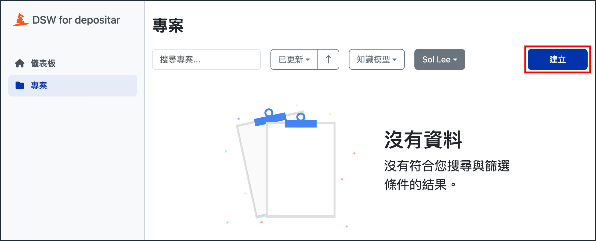

2. 在隨後的「建立專案」頁面中，您可以決定專案的名稱，並選擇適合您研究計畫的知識模型：

    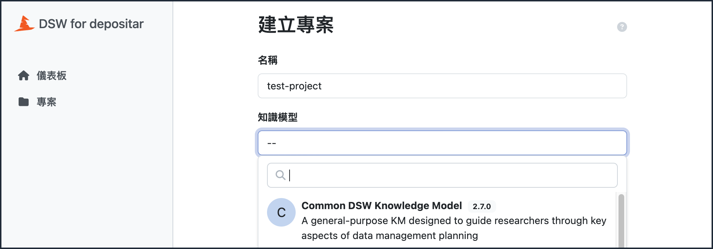

3. 選取知識模型後，您可以選擇專案語言（將影響問卷語言）與問題標籤（將影響問卷呈現之題目），我們推薦您使用 `Science Europe DMP` 問題標籤。選取完成後，點選右下方的 `建立` 按鈕以建立專案：

    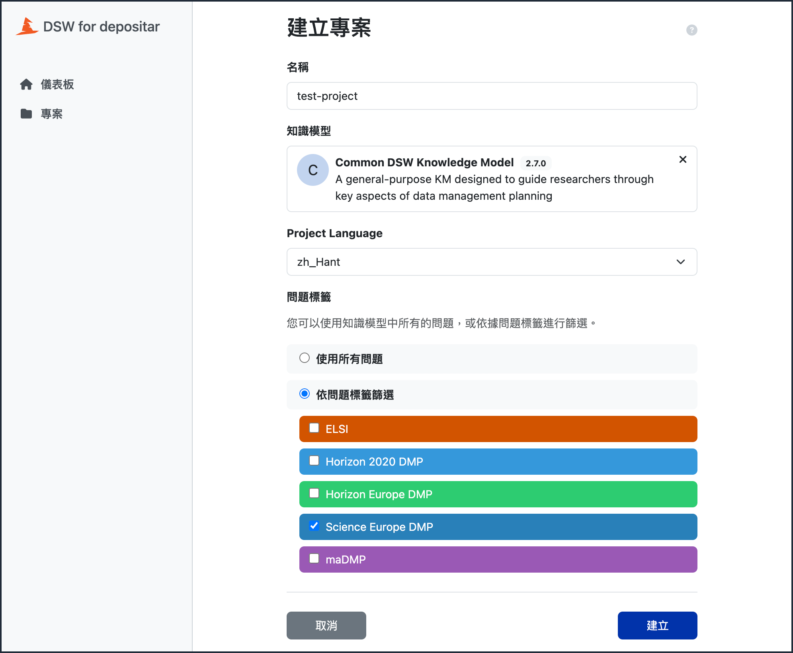

> **備註：**
>
> 目前僅提供 Common DSW Knowledge Model。

### 填寫問卷

1. 專案建立後，您會看到如以下畫面的問卷：

    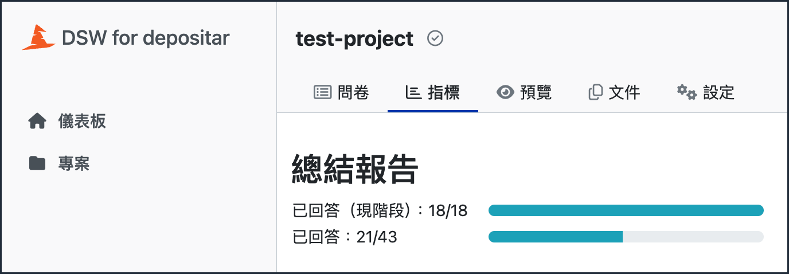

    每個問題具有以下三種回答狀態：

    * 標題為紅色，帶有鉛筆圖示：此問題必須在目前階段回答
    * 標題為淺灰色，帶有沙漏圖示：此問題需要在後續階段回答
    * 標題為綠色，帶有勾號圖示：此問題已回答

    請根據頁面上的指引，至少填寫各章節必須回答的問題。亦請參考[《國際合用的研究資料管理實用指南—增訂版》](https://data.depositar.io/dataset/se_rdm_guides/resource/5d96f870-419a-4f55-b025-40a200a2ef7a)第 17 至 25 頁的資料管理方案範本。

    > **備註：**
    >
    > 您可於填寫問卷時，使用包括「待辦項目」、「留言」與「版本紀錄」等實用工具。請參考[官方文件](https://guide.ds-wizard.org/en/latest/application/projects/list/detail/questionnaire.html)。

2. 您可點選上方選單的「指標」頁籤，以確認問卷的回答情形：

    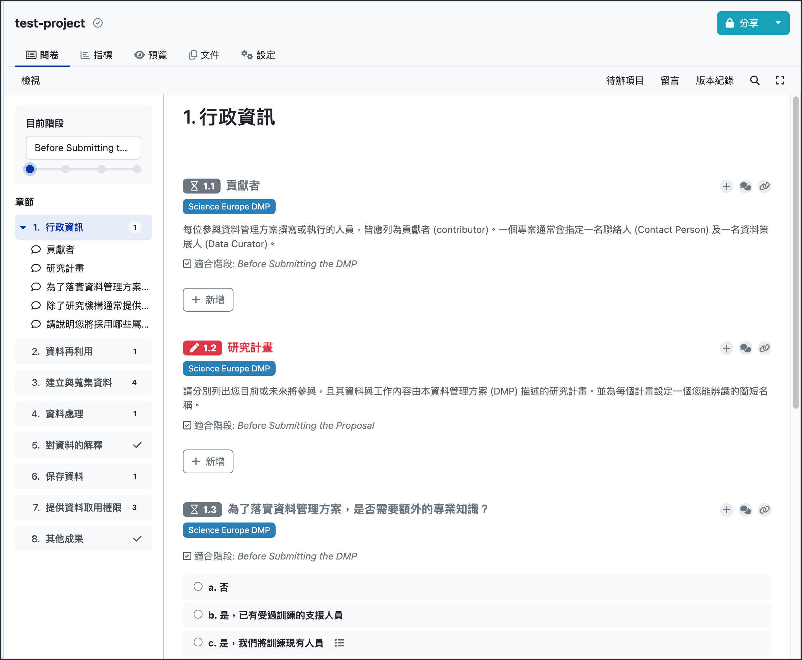

### 產製資料管理方案 (DMP) 文件

1. 問卷填寫完成後，切換到頁面上方選單的「文件」頁籤，並在下一個畫面點選 `新文件` 按鈕：

    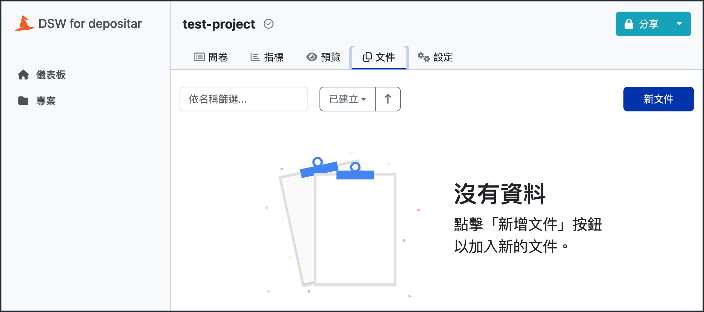

2. 在隨後的「新的文件」頁面中，您可以決定文件的名稱（即檔案名稱，僅支援英文）、使用的文件模板與輸出檔案格式。選取完成後，點選右下方的 `建立` 按鈕以產製文件：

    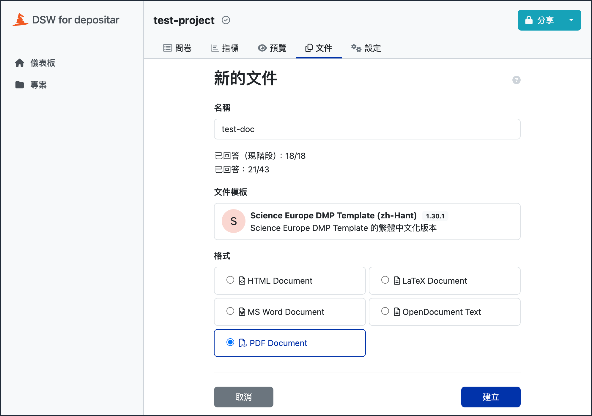

> **備註：**
>
> 目前僅提供 Science Europe DMP Template 文件模板。請根據需求選擇英文或中文 (zh-Hant) 版本。

3. 待「佇列中」提示消失，點選文件名稱，即可下載產製的資料管理方案 (DMP) 文件。

### 專案協作

若您為該專案的擁有者，可透過專案頁面右上方的 `分享` 按鈕，與其他 DSW 註冊使用者或外部人員共同協作編寫資料管理方案：

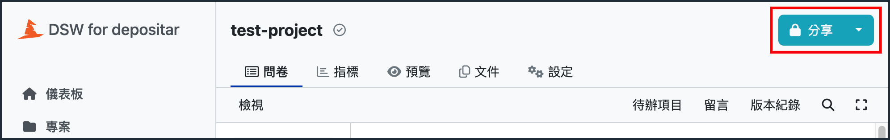

共用權限如下：

* 檢視者：可以瀏覽專案、指標、預覽與文件
* 加註者：除所有檢視者權限外，可於專案問卷上留言
* 編輯者：除所有加註者權限外，可以填寫問卷、使用待辦項目與版本紀錄功能，並且可以產製 DMP 文件
* 擁有者：除所有編輯者權限外，可以設定分享權限，以及進行專案設定

您亦可將此專案設定為其他使用者均可檢視、留言或編輯，或建立無需登入即可檢視、留言或編輯的公開連結：

